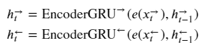

# NLP_code_assignment1

생성 일시: 2022년 10월 11일 오전 10:41
진행: 진행
태그: class

## 3 - Neural Machine Translation by Jointly Learning to Align and Translate

### Introduction

### `previous model`

- decoder에서 다음 단어를 예측하는 모든 time-step마다 다음을 linear layer 𝑓 에 input으로 넣음
    - encoder context vector 𝑧
    - embedded input word 𝑑(𝑦𝑡)
    - decoder hidden state 𝑠𝑡
- 이러한 방식은 encoder 문장의 정보의 손실을 최소한으로 줄일 수 있다는 장점이 있지만, 디코더에서 단어를 예측하는 매 time-step마다 인코더의 전체 문장에 대한 정보를 똑같이 계속 본다는 문제점이 있음

### `Attention`

- attention을 통해서 encoder의 source sentence 중 decoder의 이번 time-step에서 단어를 예측하는 데에 가장 관련이 큰 단어에 주목하게 하는 효과를 줄 수 있음
- source sentence의 길이만큼의 크기인 attention vector 𝑎 를 계산할 것
- attention vector는 각 요소가 0에서 1사이이고, 합은 1인 특성을 가지고 있음
- 이후 source sentence의 hidden states와 가중합 하는 과정을 통해서 weighted source vector 𝑤을 계산함

---

### Encoder

### `bidirectional RNN`

- a single layer GRU 로 구현하고
- 또한 bidirectional RNN 을 활용하여 이전 단어의 문맥 뿐 아니라 다음 단어의 문맥도 반영하고자 함
    - two RNNs in each layer
    - A forward RNN: 문장의 왼쪽부터 오른쪽까지를 지나며 embedding
    - A backward RNN: 문장의 오른쪽부터 왼쪽까지를 지나며 embedding



- 수식 의미: time step t 에서의 각 방향 encoder hidden states ℎ→𝑡 는
    - input으로 다음의 2가지를 받고
        - embedded word 𝑒(𝑥→𝑡),
        - 이전 time step t-1에서의 encoder hidden states ℎ→𝑡−1
    - 이를 bidirectional RNN (GRU는 필요한 정보를 기억하기 위해 발전된 RNN의 한 종류) 를 거쳐서 산출됨
- bidirectional RNN을 거치게 되면 2개의 context vector를 얻게 됨
    - forward RNN 방향에서 문장의 마지막 단어를 본 이후 산출되는 context vector 𝑧→=ℎ→𝑇
    - backward RNN 방향에서 문장의 첫 단어를 본 이후 산출되는context vector 𝑧←=ℎ←𝑇

### `RNN returns`

- outputs
    - size: **[src len, batch size, hid dim * num directions]**
    - 3번째 차원은 forward와 backward의 hidden states가 concatenated 되어서 함께 나타나게 됨.
        - 예) ℎ1=[ℎ→1;ℎ←𝑇], ℎ2=[ℎ→2;ℎ←𝑇−1]
    - encoder hidden states라고 하면 forward and backward concatenated 된 모든 것을 의미하며 다음과 같이 표현함
        - 𝐻={ℎ1,ℎ2,...,ℎ𝑇}
    - 예를 들어 src len=4, batch size=1, hid dim=4라고 할 때의 outputs (코드에 나와있는 바와 같이 last layer만 산출된다고 했을 때)
    
    ```python
    [[[ℎ→1;ℎ←𝑇]],
     [[ℎ→2;ℎ←𝑇−1]],
     [[ℎ→3;ℎ←𝑇−2]],
     [[ℎ→4;ℎ←𝑇−3]]]
    
    #T=4
    #3번째 차원의 원소의 개수는 8 (4*2)
    ```
    
- hidden
    - size: **[n layers*num directions, batch size, hid dim]**
    - **[-2, :, :]** 는 forward RNN의 최종 hidden state (맨 오른쪽 단어까지 다 본 후)
    - **[-1, :, :]**는 backward RNN의 최종 hidden state (맨 왼쪽 단어까지 다 본 후)
    - 예를 들어 n layers=4, batch size=1, hid dim=4일 때의 hidden
    
    ```python
    [[[ℎ→1]],
     [[ℎ←𝑇]],
     [[ℎ→2]],
     [[ℎ←𝑇−1]],
     [[ℎ→3]],
     [[ℎ←𝑇−2]],
     [[ℎ→4]],
     [[ℎ←𝑇−3]]]
    
    #T=4
    #3번째 차원의 원소의 개수는 4 (=hid dim)
    ```
    

### `context vector`

- decoder는 bidirection이 아니기 때문에 initial hidden state 𝑠0 에는 single context vector 𝑧를 사용할 수 밖에 없음
- 현재 encoder에서는 forward 와 backward 2개의 hidden state가 있기 때문에 이 둘을 concatenating하는 방식으로 이를 해결함


- 수식의 의미
    - 1) forward와 backward의 final time-stamp hidden state (ℎ→𝑇,ℎ←𝑇) 를 concatenate함
    - 2) 이를 linear layer 𝑔를 거치게 하고
    - 3) 이 결과물에 tanh activation function 을 거치게 함
    
    → 이를 통해 최종 encoder의 single context vector이자 decoder의 initial hidden state를 사용함 
    
- 이 수식의 경우 paper와 다르게 조금 수정되었는데,
    - paper에서는 오직 backward RNN hidden state만을 사용하지만
    - 이 수식에서는 bidirection 정보를 모두 포함하도록 수정되었음

### `code 설명`

- `embedded = self.dropout(self.embedding(src))`
    - src=[src len, batch size]로, 예를 들어 batch.src의 결과를 살펴볼 경우 다음과 같이 이루어져 있음을 알 수 있다.
    
    ```python
    tensor([[  2,   2,   2,  ...,   2,   2,   2],
            [ 18,   8,  17,  ...,   8,  18,  18],
            [103,  16, 523,  ...,  36, 103, 168],
            ...,
            [  1,   1,   1,  ...,   1,   1,   1],
            [  1,   1,   1,  ...,   1,   1,   1],
            [  1,   1,   1,  ...,   1,   1,   1]], device='cuda:0')
    ```
    
    - src는 각 토큰별 토큰의 id로 변환된 후, batch로 묶어서 저장되어 있는 input이라고 볼 수 있다.
    - embedding layer는 dictionary size만큼의 embedding lookup table이 존재하고, 이 lookup table에서 토큰의 id, 즉 index의 행을 가져와 embedding을 붙이게 된다.
    - self.embedding은 이를 임베딩하는 역할을 하는데, nn.Embedding은 input에 embedding_dim이 추가되는 형태임을 알 수 있다.
    
    ```python
    #src = [src len, batch size]
            
    embedded = self.dropout(self.embedding(src))
            
    #embedded = [src len, batch size, emb dim]
    ```
    
- `outputs, hidden = self.rnn(embedded)`
    - rnn의 input은 embeded로 size는 [src len, batch size, emb dim]이다.
    - rnn 셀의 연산은 `self.rnn = nn.GRU(emb_dim, enc_hid_dim, bidirectional = True)` 에서 bidirectional로 이루어진다.
    - 각각 forward와 bacward의 연산으로 이루어지며, 각각의 연산은 위에서 언급했던 수식에 매칭된다.
      
        
        
        - 𝑒(𝑥→𝑡) 은 각 time-step 별 embeded된 토큰을 의미하고, 이전 time-step에서의 hidden state는 다음 time-step에서의 hidden state를 구하는 데에 input으로 들어간다.
    - outputs는 **[src len, batch size, hid dim * num directions]** 의 size로 이루어져 있고, last layer에서의 output을 의미한다. 각 time-step 별 forward와 backward의 hidden state가 함께 나타난다.  아래는 그 예시이다. (batch size가 1이라고 가정)
      
        ```python
        [[[ℎ→1;ℎ←𝑇]],
         [[ℎ→2;ℎ←𝑇−1]],
         [[ℎ→3;ℎ←𝑇−2]],
         [[ℎ→4;ℎ←𝑇−3]]]
        ```
        
    - hidden은 모든 layer에서의 hidden state가 stack되어 나타나지만, 본 코드에서는 layer가 한개 이므로 하나의 layer에 대한 forward, backward hidden state가 차례로 쌓여있다.  아래는 그 예시이다. (batch size가 1이라고 가정)
      
        ```python
        [[[ℎ→1]],
         [[ℎ←𝑇]]]
        ```
        
    - `hidden = torch.tanh(self.fc(torch.cat((hidden[-2,:,:], hidden[-1,:,:]), dim = 1)))`
        - encoder의 single context vector이자 decoder의 initial hidden state를 산출하는 코드이다.
        - 따라서 아래의 수식에 대응된다.
        
        
        
        - forward와 backward의 context vector를 concat한 후에 linear layer를 거치고, tanh activation function을 거친다.
        - 이로써 hidden은 [batch size, decoder hid dim]의 size를 가지게 된다.

---

### Attention

### `attention layer`

- input
    - decoder의 이전 hidden state 𝑠𝑡−1
    - encoder의 모든 forward와 backward hidden state가 stack된 𝐻
      
        (위에서 살펴본 바와 같이 ℎ1=[ℎ→1;ℎ←𝑇], ℎ2=[ℎ→2;ℎ←𝑇−1] 일 때 𝐻={ℎ1,ℎ2,...,ℎ𝑇} )
    
- output
    - attention vector 𝑎𝑡
        - length = source sentence
        - 𝑎𝑡 벡터의 각 요소는 0과 1사이의 값을 갖고, 모든 요소들의 합은 1이다.

→ 𝑎𝑡 는 다음 단어를 decoder에서 예측할 때 source sentence의 어떤 단어데 더 많이 주목해야 하는지 나타내는 것이다. 

### `Energy`

- 첫 번째로 계산할 것은 previous decoder hidden state와 encoder hidden state 사이의 energy를 계산하는 것이다.
- encoder hidden state 𝐻={ℎ1,ℎ2,...,ℎ𝑇} 는 T개의 tensor이고, decoder hidden state 𝑠𝑡−1는 하나의 tensor이므로, 𝑠𝑡−1를 T 타임 `repeat` 하여 계산한다.


- 수식의 의미
    - 1) 𝑠𝑡−1와 𝐻를 각각 concat한다.
        - 예시: [𝑠𝑡−1;ℎ1], … , [𝑠𝑡−1;ℎT]
    - 2) linear layer `attn` 을 지난다.
    - 3) tanh activation function을 지난다.

→ 이를 통해서 encoder의 hidden state가 decoder hidden state와 얼마나 잘 “match” 되는지 확인할 수 있다. 

### `attention vector`

- 하나의 example에 대해서 𝐸𝑡 는 **[dec hid dim, src len]**의 size를 갖는다.
- 이것의 size를 **[src len]** 으로 변환하는 작업을 진행한다.
  
    
    
- 수식의 의미: 𝐸𝑡의 size를 **[dec hid dim, src len]** → **[src len]** 으로 변환시키기 위해 [1, dec hid dim]을 가지는 tensor 𝑣를 곱해준다.
- 𝑣 는 energy의 가중합에서 가중치로 볼 수 있다. 처음에는 random하게 초기화되지만 backpropagation을 통해서 학습된다.
- 𝑣 는 bias가 없는 linear layer로 구현된다.

- softmax 함수를 거쳐 최종 벡터 산출하기
  
    
    
- attention vector의 모든 요소가 0과 1사이의 값을 갖게 되고, 그 앞이 1이 된다.

### `code 설명`

- `self**.**attn **=** nn**.**Linear((enc_hid_dim ***** 2) **+** dec_hid_dim, dec_hid_dim)`
  
    
    
    - 이 수식에서 atten layer를 정의하는 부분이다.
    - input으로  [𝑠𝑡−1;ℎ1], … , [𝑠𝑡−1;ℎT] 가 들어가기 때문에 input의 차원은 `(enc_hid_dim ***** 2) **+** dec_hid_dim` 가 되고
    - output으로는 `dec_hid_dim` 을 반환하게 된다.

- `self**.**v **=** nn**.**Linear(dec_hid_dim, 1, bias **=** **False**)`
  
    
    
    - 이 수식에서 𝑣를 정의하는 부분이다.
    - 𝑣 는 𝐸𝑡와 곱해져 차원을  **[dec hid dim, src len]** → **[src len]**  로 변화시키이기에 (`dec_hid_dim, 1`) 차원으로 구현된다.
    
- `hidden **=** hidden**.**unsqueeze(1)**.**repeat(1, src_len, 1)`
    - 첫 번째 hidden (s0) 은 encoder의 최종 context vector로써, **[batch size, decoder hid dim]** 의 size를 가지고 있다.
    - 이를 `unsqueeze(1)`을 하게 되면 이 size는 **[batch size, 1, decoder hid dim]** 로 변환된다. (unsqueeze(1)는 dim 1에 1차원을 추가)
    - 이를 `repeat(1, src_len, 1)` 하게되면, **[batch size, src_len, decoder hid dim]** 로 차원이 변환된다.
    
- `energy **=** torch**.**tanh(self**.**attn(torch**.**cat((hidden, encoder_outputs), dim **=** 2)))`
  
    
    
    - 수식에 대응되는 부분이다.
    - `torch**.**cat((hidden, encoder_outputs), dim **=** 2)`을 통해서
    
    ```
    #hidden = [batch size, src len, dec hid dim]
    #encoder_outputs = [batch size, src len, enc hid dim * 2]
    ```
    
    - 였던 차원이 **[batch size, src len, enc hid dim * 2 + dec hid dim ]** 으로 변화하게 되고 3번재 차원이 attn layer의 input 차원과 동일해진다.
    
- `attention **=** self**.**v(energy)**.**squeeze(2)`
  
    
    
    - 위 수식에 대응되는 부분이다.
    - *`energy = [batch size, src len, dec hid dim]`*
    - 였던 차원은 위 계산을 통해서
    - *`attention= [batch size, src len]`*
    - 차원으로 변화하게 된다.

- **`return** F**.**softmax(attention, dim**=**1)`
  
    
    
    - 위 수식에 대응되는 부분이다.
    - 최종적으로 src len 길이 만큼의, 각각의 src token에 얼마만큼 attention 해야하는지 가중치가 담긴 attention vector가 산출된다.
    

---

### Decoder

### `Weighted source vector`

- 수식
  
    
    
- encoder hidden states H 의 가중합
- 가중치는 𝑎𝑡
  
    

### `decoder hidden state`

- 수식
  
    
    
- input
    - embedded input word 𝑑(𝑦𝑡)
    - weighted source vector 𝑤𝑡
    - previous decoder hidden state 𝑠𝑡−1
    - 이 때, embedded input word와 weighted source vector는 concat되어서 들어감
- GRU layer를 거치면서 decoder hidden state를 생성함

### `prediction of the next word`

- 수식
  
    
    
- input
    - embedded input word 𝑑(𝑦𝑡)
    - weighted source vector 𝑤𝑡
    - decoder hidden state 𝑠𝑡
    - 3가지 input이 모두 concat 되어 들어감
- linear layer 𝑓 를 거쳐서 가장 적합할 것으로 예상되는 단어를 출력함

### `code 설명`

```
#input = [batch size]
input= input.unsqueeze(0)
#input = [1, batch size]

embedded= self.dropout(self.embedding(input))
#embedded = [1, batch size, emb dim]
```

- 해당 time-step input의 embedding 𝑑(𝑦𝑡)을 산출하는 과정이다.

```
a= self.attention(hidden, encoder_outputs)
#a = [batch size, src len]

a= a.unsqueeze(1)
#a = [batch size, 1, src len]
```

- attention layer를 통해 attention vector를 산출하는 과정이다.
- 이전 시점의 decoder state vector와 encoder outputs가 input으로 들어가서 attention vector 𝑎𝑡를 산출한다.

```
encoder_outputs= encoder_outputs.permute(1, 0, 2)
#encoder_outputs = [batch size, src len, enc hid dim * 2]

weighted= torch.bmm(a, encoder_outputs)
#weighted = [batch size, 1, enc hid dim * 2]
```

- encoder hidden state를 가중합하여 weighted vector를 산출하는 과정이다.
  
    
    
- torch.bmm 연산을 하기 위해서 encoder output을 permute한다.
- **[batch size, 1, src len]** (a) 과 **[batch size, src len, enc hid dim * 2]** (encoder_outputs) 사이 matrix multiplication을 진행하여 최종적으로 weighted **[batch size, 1, enc hid dim * 2]** 를 산출한다.

```python
rnn_input= torch.cat((embedded, weighted), dim= 2)
#rnn_input = [1, batch size, (enc hid dim * 2) + emb dim]

#hidden = [batch size, dec hid dim] (t-1 시점의 decoder hidden state)
output, hidden= self.rnn(rnn_input, hidden.unsqueeze(0))

#output = [seq len, batch size, dec hid dim * n directions]
#hidden = [n layers * n directions, batch size, dec hid dim]

#seq len, n layers and n directions will always be 1 in this decoder, therefore:
#output = [1, batch size, dec hid dim]
#hidden = [1, batch size, dec hid dim]
#this also means that output == hidden
assert (output == hidden).all()
```

- RNN을 통하여 현재 tme-step decoder hidden state 𝑠𝑡를 산출하는 과정이다.
  
    
    
- torch.nn.RNN의 input은 다음과 같이 이루어진다.
  
    
    
- 따라서 3가지 input 중 현재 시점의 단어의 embedded와 weighted vector는 concat하여 rnn input의 첫 번째 인자로 들어가고, hidden은 h_0으로서 2번째 인자로 들어간다.

```python
#embedded = [1, batch size, emb dim]
#output = [1, batch size, dec hid dim]
#weighted = [1, batch size, enc hid dim * 2]

embedded= embedded.squeeze(0)
output= output.squeeze(0)
weighted= weighted.squeeze(0)

prediction= self.fc_out(torch.cat((output, weighted, embedded), dim= 1))
#prediction = [batch size, output dim]
```

- 다음 시점의 단어 토큰을 예측하는 단계이다.
  
    
    
- output dim의 크기로 prediction이 산출되고, 이는 가장 확률이 높은 다음 단어 예측에 활용된다.
- output dim은 dictionary의 number라고 할 수 있고, 각각의 vocab의 위치별로 얼마만큼의 확률이 올지를 예측하여 반환하는 역할을 한다.

---

### seq2seq

### `code 설명`

```
#first input to the decoder is the <sos> tokens

input = trg[0,:]
```

- decoder loop을 시작하기 전 첫 번째 input으로 들어가는 단어는 <sos> 토큰이므로, trg의 batch size만큼의 sos token id 가 input으로 들어가게 된다.

```
for tin range(1, trg_len):

#insert input token embedding, previous hidden state and all encoder hidden states
#receive output tensor (predictions) and new hidden state

output, hidden= self.decoder(input, hidden, encoder_outputs)
```

- decoder가 넘겨주는 파라미터로는
    - t 시점의 input
    - t-1 시점의 hidden state
    - encoder의 outputs
    - 위의 3가지가 들어가게 된다.
- decoder가 반환해주는 값은
    - output은 decoder code에서의 prediction으로, target sentence의 다음 단어 예측을 위한 값을 나타낸다.
    - hidden의 경우 decoder의 RNN을 지나고 난 뒤 나오게 되는 t 시점의 hidden state를 의미한다.

```
#get the highest predicted token from our predictions
top1= output.argmax(1)
```

- decoder의 output_dim은 trg_vocab_size와 동일한 크기이다.
- batch 속 하나의 example에 대한 output 벡터의 각 인덱스는, vocab token id의 인덱스와 대응된다.
    - vocab 크기가 4일 때, output 벡터가 예를 들어 다음과 같다고 하자
    
    ```python
    output= [[1.6, 7.8, -4.7, 9.8]] 
    # batch가 1이라고 가정
    ```
    
    - 이는 output[0][3]는 trg_vocab token id 3번에 해당하는 것으로, 4가지 토큰 중 3번 토큰이 나올 확률이 가장 높다는 것을 의미한다.
- 따라서 `output.argmax(1)` 을 할 경우 각 배치 별로 가장 확률이 높은 토큰의 인덱스를 반환하게 되고, 이는 즉 trg_vocab에서의 token id를 반환하게 되는 것과 같다.

---

### Training the Seq2Seq Model

### `변수 설정`

```
INPUT_DIM= len(SRC.vocab)
OUTPUT_DIM= len(TRG.vocab)
ENC_EMB_DIM= 256
DEC_EMB_DIM= 256
ENC_HID_DIM= 512
DEC_HID_DIM= 512
ENC_DROPOUT= 0.5
DEC_DROPOUT= 0.5
```

- torch.nn.Embedding layer의 파라미터는 다음과 같이 구성된다.
  
    
    
- 그 중 input_dim, output_dimdms num_embeddings에 / enc_emb_dim, dec_emb_dim 은 embedding dim에 대응된다.
- INPUT_DIM 은 src.vocab의 길이와 같고, encoder의 embedding layer의 embedding의 dictionary size가 된다.
- OUTPUT_DIM은 trag.vocab의 길이와 같고, decoder의 embedding layer의 embedding의 dictionary size가 된다.
- ENC_EMB_DIM은 encoder의 embedding layer의 embedding dim이 된다.
- DEC_EMB_DIM은 decoder의 embedding layer의 embedding dim이 된다.

### `train`

- train은 batch 단위로 src와 trg이 들어가면서 이루어진다.

```
for i, batch in enumerate(iterator):

	src= batch.src
	trg= batch.trg
```

- 첫 번째 batch에서의 src의 값과 trg의 값은 다음과 같다.
    - src  *`[src len, batch size]`*
    
    ```python
    tensor([[  2,   2,   2,  ...,   2,   2,   2],
            [ 18,   8,  17,  ...,   8,  18,  18],
            [103,  16, 523,  ...,  36, 103, 168],
            ...,
            [  1,   1,   1,  ...,   1,   1,   1],
            [  1,   1,   1,  ...,   1,   1,   1],
            [  1,   1,   1,  ...,   1,   1,   1]], device='cuda:0')
    ```
    
    - trg  *`[trg len, batch size]`*
    
    ```python
    tensor([[ 2,  2,  2,  ...,  2,  2,  2],
            [ 7,  4,  4,  ...,  4,  4, 19],
            [14,  9, 38,  ..., 64, 38, 41],
            ...,
            [ 1,  1,  1,  ...,  1,  1,  1],
            [ 1,  1,  1,  ...,  1,  1,  1],
            [ 1,  1,  1,  ...,  1,  1,  1]], device='cuda:0')
    ```
    
- 이를 통해서 <sos> 토큰의 경우 vocab에서의 token idx는 2, <pad> 토큰의 경우 vocab에서의 token idx는 1이라는 것을 확인할 수 있다.

- output의 결과

```python
output = model(src, trg)
        
#output = [trg len, batch size, output dim]
```

- output은 각 trg len의 time-step별로 해당 time-step에서 나올 단어 중 가장 확률이 높은 단어가 무엇인지에 대한 정보가 담겨있다.
    - 이 정보는 3번째 차원인 output_dim에서 확인할 수 있고, 이를 이용하여 loss를 계산하여 학습이 이루어진다.

- loss 계산의 과정

```
output= output[1:].view(-1, output_dim)
trg= trg[1:].view(-1)

#output = [(trg len - 1) * batch size, output dim]
#trg = [(trg len - 1) * batch size]
```

- output과 trg모두 첫 번째 차원에서 0번 인덱스의 값을 배고 [1:]로 진행하는 이유는, 첫번째 토큰의 값은 <sos> 로써 제외하고 진행하기 위함이다.
- output은 2차원으로, trg은 1차원으로 차원을 변경시킨다.
- 예를 들어서 batch size=1, trg len=4, output_dim=5라고 했을 때
    - output 은 각 시점과 batch 별 vocab에 있는 단어 중 다음 토큰이 될 단어들의 확률을 나타낸다.
    
    ```python
    [[0.9, 9.8, -3.0, 2.0, 4.6], # 시점 0, batch 1에서의 단어들의 확률값 조합
     [0.9, 0.8, -5.0, -7.0, 4.8], # 시점 1, batch 1에서의 단어들의 확률값 조합
     [1.4, 5.8, 8.0, 4.0, 4.6], # 시점 2, batch 1에서의 단어들의 확률값 조합
     [-2.9, -5.8, -1.1, 2.0, 9.6]] # 시점 3, batch 1에서의 단어들의 확률값 조합
    ```
    
    - trg 은 각 시점과 batch별 vocab에 있는 정답 toekn id를 가진다.
    
    ```python
    [[2], # 시점 0, batch 1에서의 정답 token id
     [1], # 시점 1, batch 1에서의 정답 token id
     [4], # 시점 2, batch 1에서의 정답 token id
     [3]] # 시점 3, batch 1에서의 정답 token id
    ```
    

```
loss= criterion(output, trg)

loss.backward()
```

- 여기서 loss는 cross entropy loss를 사용한다.
- `criterion **=** nn**.**CrossEntropyLoss(ignore_index **=** TRG_PAD_IDX)`
- 코드에는 위와 같이 정의되어 있고, pad index에 대해서는 loss 계산을 하지 않도록 설정되어 있다.
- cross entropy 구하기
    - cross entropy 의 input으로는 다음의 2가지가 들어간다.
        - `score`  = [Batch size x the number of Class]
            - 각 class 별로 확률을 operation한 결과 (이 코드에서는 output)
        - `target`  = [Batch size]
            - 정답 class를 가리키는 target 값 (이 코드에서는 trg)
        - input에서 주의해야할 점은 crossentropyloss에는 이미 logsoftmax가 포함되어 있기 때문에 input을 넣을 때는 log 값이 씌워진 output값이 아닌 생 output값을 줘야한다.
    
    - cross entropy 수식 계산 과정
        - output으로 나온 score에 `torch.exp` 를 씌운다.
        - `torch.sum()` 으로 모두 더해준다.
        - `torch.log` 를 씌워준다.
        - target이 정답 class index라고할 때, output[target]의 값을 전체 값에서 빼줘서 최종 loss를 구한다.
        
        → 이렇게 하게 되면, output에서 target에 해당하는 인덱스의 요소가 높은 값을 가질 수록 loss가 낮게 만들어지게 되므로, 해당 target에 해당하는 값이 확률값이 크게 갖게 되도록 학습된다. 
        
    
- optimizer을 통해 backpropagation이 일어나고 모델의 파라미터들의 업데이트되며 학습이 진행된다.

### `evaluate`

- loss 계산
  
    ```python
    output = output[1:].view(-1, output_dim)
    trg = trg[1:].view(-1)
    
    #trg = [(trg len - 1) * batch size]
    #output = [(trg len - 1) * batch size, output dim]
    
    loss = criterion(output, trg)
    ```
    
    - train에서와 동일한 방식으로 loss가 계산된다.
    - `model.eval()` 로 설정하였으므로 파라미터 업데이트와 backpropagation은 일어나지 않는다.